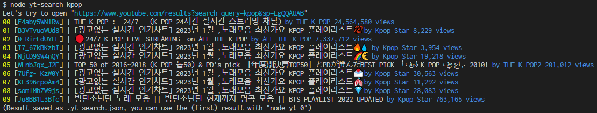
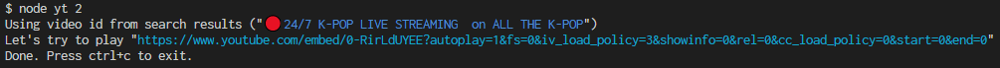
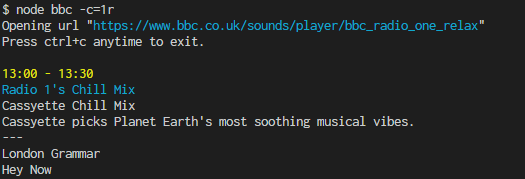

# phantomus

Quick and dirty cli music player using puppeteer.

Install: `git clone https://github.com/szkrd/phantomus.git && cd phantomus && npm install`

## yt-search

- Help: `node yt-search --help`
- Search for live feeds:
  - lo fi: `node yt-search "lofi girl"`
  - drone: `node yt-search "cryo chamber"`
  - enka: `node yt-search enka`
  - jpop: `node yt-search jpop`
  - etc.



## yt

- Help: `node yt --help`
- Play video: `node yt --vid=FuWljRgJYKw`
- Play video based on **yt-search** result: `node yt 0` / `node yt 9`
- Install a specific channel to user bin: `TO=~/bin/yt-synthwave&&echo -e '#!/usr/bin/env bash'>$TO&&echo "node $(pwd)/yt --vid=q5OjZhOYhow">>$TO&&chmod +x $TO&&unset TO`



## bbc

- Help: `node bbc --help`
- List channels: `node bbc --list-channels` / `node bbc -l`
- List channel id abbreviations: `node bbc --show-channel-info` / `node bbc -ci`
- Play channel: `node bbc --channel=bbc_1xtra` / `node bbc -c=bbc_6music` / `node bbc -c=4`  
  `node bbc --fuzzy=world` / `node bbc -f=four` / `node bbc -c=a`
- Install to user bin: `TO=~/bin/bbc&&echo -e '#!/usr/bin/env bash'>$TO&&echo "node $(pwd)/bbc \$@">>$TO&&chmod +x $TO&&unset TO`



## install with functions/aliases

Add to your `.bashrc` or `.bash_aliases`.

```bash
function yt() { node /home/.../phantomus/yt.js "$@"; }
alias yt-foobar="yt --vid=0_2t6VYgwOY"
alias yt-search="node /home/.../phantomus/yt-search.js"
alias bbc="node /home/.../phantomus/bbc.js"
```
